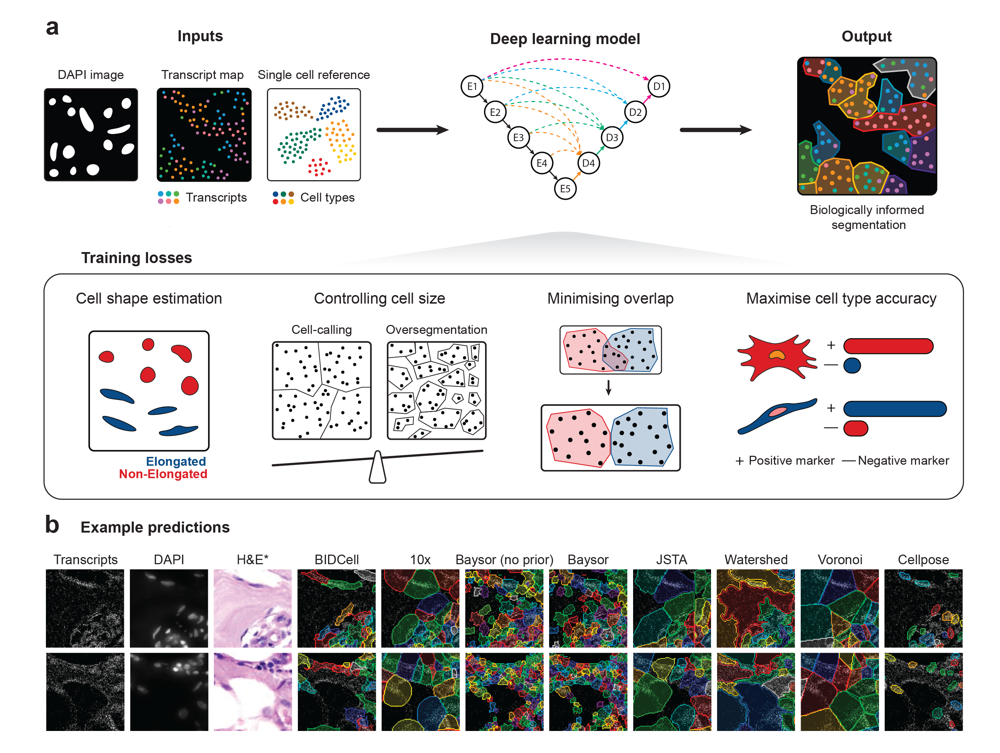

# BIDCell: Biologically-informed self-supervised learning for segmentation of subcellular spatial transcriptomics data

For more details of our method, please refer to: https://doi.org/10.1101/2023.06.13.544733

Recent advances in subcellular imaging transcriptomics platforms have enabled spatial mapping of the expression of hundreds of genes at subcellular resolution and provide topographic context to the data. This has created a new data analytics challenge to correctly identify cells and accurately assign transcripts, ensuring that all available data can be utilised. To this end, we introduce BIDCell, a self-supervised deep learning-based framework that incorporates cell type and morphology information via novel biologically-informed loss functions. We also introduce CellSPA, a comprehensive evaluation framework consisting of metrics in five complementary categories for cell segmentation performance. We demonstrate that BIDCell outperforms other state-of-the-art methods according to many CellSPA metrics across a variety of tissue types of technology platforms, including 10x Genomics Xenium. Taken together, we find that BIDCell can facilitate single-cell spatial expression analyses, including cell-cell interactions, enabling great potential in biological discovery.



## Installation

> **Note**: A GPU with at least 12GB VRAM is strongly recommended for the deep learning component, and 32GB RAM for data processing.
We ran BIDCell on a Linux system with a 12GB NVIDIA GTX Titan V GPU, Intel(R) Core(TM) i9-9900K CPU @ 3.60GHz with 16 threads, and 64GB RAM.

1. Create virtual environment (Python>=3.9,<3.13):
```sh
conda create --name bidcell python=3.10
```    
2. Activate virtual environment:
```sh
conda activate bidcell
```
3. Install package:
```sh
python -m pip install bidcell
```
Installation of dependencies typically requires a few minutes. 


## Demo

A small subset of Xenium breast cancer data is provided as a demo. Use the following to run all the steps to verify installation:
```sh
python example_small.py
```
## Parameters

Parameters are defined in .yaml files. Examples are provided for 4 major platforms, including Xenium, CosMx, MERSCOPE, and Stereo-seq. BIDCell may also be applied to data from other technologies such as MERFISH. Run the following to obtain examples: 
```py
from bidcell import BIDCellModel
BIDCellModel.get_example_config("xenium")
BIDCellModel.get_example_config("cosmx")
BIDCellModel.get_example_config("merscope")
BIDCellModel.get_example_config("stereoseq")
```
This will copy the .yaml for the respective vendor into your working directory, for example `xenium_example_config.yaml`. 

## Example usage

The full dataset (Xenium Output Bundle In Situ Replicate 1) may be downloaded from https://www.10xgenomics.com/products/xenium-in-situ/preview-dataset-human-breast. The breast cancer reference data are provided with this package under `data/sc_references`, or `./example_data/sc_references` if you have run `example_small.py`. Please ensure the correct paths are provided for the parameters under `files` in `xenium_example_config.yaml`, in particular, the paths for the transcripts (`transcripts.csv.gz`) and DAPI (`morphology_mip.ome.tif`) files.

To run the entire pipeline (data processing, training, prediction, and extracting the cell-gene matrix):
```py
from bidcell import BIDCellModel
model = BIDCellModel("xenium_example_config.yaml")
model.run_pipeline()
```
Alternatively, the pipeline can be broken down into 3 main stages:
```py
from bidcell import BIDCellModel
model = BIDCellModel("xenium_example_config.yaml")
model.preprocess()
model.train()
model.predict()
```
Or, functions in `preprocess` can be called individually:
```py
from bidcell import BIDCellModel
model = BIDCellModel("xenium_example_config.yaml")
# model.stitch_nuclei() # for when nuclei images are separated into FOVs (e.g., CosMx)
model.segment_nuclei()
model.generate_expression_maps()
model.generate_patches()
model.make_cell_gene_mat(is_cell=False)
model.preannotate()
model.train()
model.predict()
```
## Single-cell reference and markers

BIDCell uses single-cell reference data for improved results. These can be downloaded from public repositories such as TISCH2, Allen Brain Map, and the Human Cell Atlas. 

Please see the provided breast cancer single-cell reference and positive/negative marker files (`sc_breast.csv`, `sc_breast_markers_pos.csv`, and `sc_breast_markers_neg.csv`) as a template.

The reference csv file contains average expressions for all of the genes in the spatial transcriptomic dataset of different cell types. You may choose an appropriate list of cell types to include for your data.

The positive and negative markers files contain the respective marker genes for each cell type. The positive and negative markers were those with expressions in the highest and lowest 10 percentile for each cell type of a tissue sample. We found that removing positive markers that were common to at least a third of cell types in each dataset was appropriate across various datasets. Using a larger number of positive markers tends to increase the size of predicted cells. Manual curation and alternative approaches to determine the marker genes can also be used.

Only <1,000 genes are needed to perform segmentation. Specify a selection of genes in a file (see Stero-seq example).


## Segmentation architectures:
The default is UNet3+ https://arxiv.org/abs/2004.08790, and we have found it to perform well across different technologies and tissue types.
To use a different architecture, select from a list of popular backbones or define your own:
  - Set `model_params.name` in the .yaml file with an encoder from https://segmentation-modelspytorch.readthedocs.io/en/latest/index.html
  - Or, modify `SegmentationModel` class in [`model.py`](bidcell/model/model/model.py)


## Additional information

If you receive the error: ``pickle.UnpicklingError: pickle data was truncated``, try reducing `cpus`

Performing segmentation at a higher resolution requires a larger patch size, thus more GPU memory.

Expected outputs:
- .tif file of segmented cells, where the value corresponds to cell IDs
- .csv file of gene expressions of segmented cells

Expected runtime (based on our system for the Xenium breast cancer dataset):
- Training: ~10 mins for 4,000 steps
- Inference: ~ 50 mins
- Postprocessing: ~ 30 mins


## Contact us

If you have any enquiries, especially about using BIDCell to segment cells in your data, please contact xiaohang.fu@sydney.edu.au. We are also happy to receive any suggestions and comments.


## Citation

If BIDCell has assisted you with your work, please kindly cite our paper:

Fu, X., Lin, Y., Lin, D., Mechtersheimer, D., Wang, C., Ameen, F., Ghazanfar, S., Patrick, E., Kim, J., & Yang, J. Y. H. (2023). Biologically-informed self-supervised learning for segmentation of subcellular spatial transcriptomics data. bioRxiv, 2023.2006.2013.544733. https://doi.org/10.1101/2023.06.13.544733